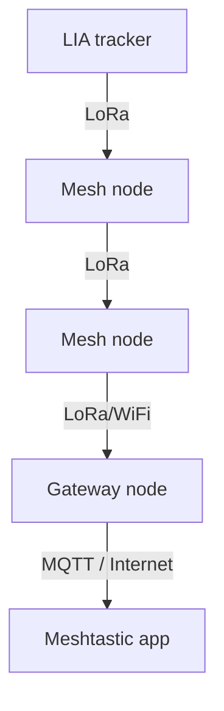

import { Tabs, TabItem } from '@astrojs/starlight/components';

LIA runs on top of [Meshtastic](https://meshtastic.org/), configured as a **tracker** role node, with its own `TrackerService` replacing stock Meshtastic's position broadcasting entirely (rather than just tuning stock settings) and a private channel gating everything LIA-specific.



## Setting the node role

<Tabs>
  <TabItem label="Meshtastic App">
    Go to **Radio Configuration → Device → Role** and select **Tracker**.
  </TabItem>
  <TabItem label="CLI">```sh meshtastic --set device.role TRACKER ```</TabItem>
</Tabs>

This matters beyond just labeling: stock Meshtastic only skips its own competing light-sleep timers for tracker-family roles, on the assumption that "sleep will be initiated through the modules" instead — which is exactly what `TrackerService`'s own BMS-driven state machine does (see [Power Management](/LIA/docs/firmware/power-management/)). Leaving the role at its default will fight the firmware's own sleep behaviour.

## Required: a private channel named "Test"

Every LIA-specific message — position broadcasts, charge-status notifications, and all `CommandService` commands and replies — is sent and received **only** on a channel literally named `Test`, looked up by name at send/receive time rather than a hardcoded channel index (so it works whichever slot you put it in). This is deliberate: Meshtastic encrypts per-channel rather than per-recipient, and position/telemetry handling in stock Meshtastic is promiscuous (any node that can decrypt a packet updates its own map from it, regardless of who it was addressed to) — sending on the public default channel would let *any* node on the mesh see this device's position. Restricting everything to a channel only people you've explicitly shared the PSK with can decrypt keeps that visibility private.

**Add a channel named exactly `Test`** (case doesn't matter, the name does) via the app's channel settings or the CLI before expecting any of the behavior below to do anything — if no channel with that name is configured, the firmware fails closed (skips the send / ignores incoming messages) rather than falling back to the public channel.

## Text commands

Send these as either a broadcast on the `Test` channel, or a direct message to the device (both work; a DM sent through the official app is commonly PKI-encrypted, which the firmware also recognizes as authorized regardless of channel). Commands are case-insensitive and tolerant of extra spacing (`led off`, `Led  Off`, and `LED OFF` all work).

| Command | Reply / effect |
| --- | --- |
| `GPS` | Current position, or "No GPS fix yet". |
| `BATTERY` | Current gauge charge percentage. |
| `IMU ON` / `IMU OFF` | Arms/disarms motion detection — sends `"Activity detected"` on a real motion event. `lia_v1` only (see [Accelerometer](/LIA/docs/firmware/accelerometer/)). |
| `CHG ON` / `CHG OFF` | Enables/disables the `"Charging"` notification. |
| `STB ON` / `STB OFF` | Enables/disables the `"Device charged"` notification. |
| `LED ON` / `LED OFF` | Manually overrides the RED status LED (see [RGB LED](/LIA/docs/firmware/rgb-led/)). |
| `HELP` | Lists all commands. |

Replies go back the same way the command arrived (DM or channel broadcast), except `IMU ON`'s activity messages, which always go to the configured target node on the `Test` channel — see below.

## Target node

The destination for position broadcasts and unsolicited notifications (charge status, activity detection) is a single NodeNum constant defined once in the firmware (`firmware/services/MeshTargets.h`) — currently a fixed development target, not yet exposed as an app-configurable setting.

## Position broadcast interval

`TrackerService` doesn't use stock Meshtastic's `position.position_broadcast_secs` setting — it broadcasts on its own fixed cadence, which depends on the BMS switch position (see [Power Management](/LIA/docs/firmware/power-management/)):

- **Continuous mode** (switch HIGH): every 30 seconds.
- **Sleep-cycle mode** (switch LOW): once per wake, roughly once a minute.

See also: [LoRa](/LIA/docs/firmware/lora/), [GPS](/LIA/docs/firmware/gps/), [Power Management](/LIA/docs/firmware/power-management/), and [Building the Firmware](/LIA/docs/firmware/building-the-firmware/).
