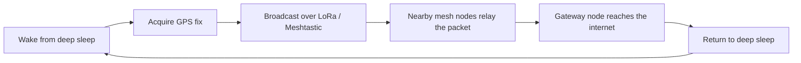

**LIA** is an open-source, low-power pet and asset tracker built on top of [Meshtastic](https://meshtastic.org/) and LoRa mesh networking. It focuses on being a compact, long-range, subscription-free tracking device that keeps working when there's no cell coverage or Wi-Fi at all.

:::note
LIA is an experimental, community-driven project. Hardware and firmware are both under active development — see the [Roadmap](https://github.com/JGAguado/LIA#roadmap) for current status before relying on it for anything safety-critical.
:::

## Why LIA exists

Most commercial pet trackers depend on a cellular subscription or a phone-tethered Bluetooth range of a few dozen meters. LIA takes a different approach: it broadcasts location over a decentralized LoRa mesh, so as long as there's a chain of Meshtastic nodes between your tracker and a gateway, you get a position — no monthly fee, no carrier lock-in.

## How it works

1. The device wakes from deep sleep on a timer or motion trigger.
2. The onboard GNSS module acquires a position fix.
3. The location is broadcast over LoRa using the Meshtastic protocol.
4. Nearby mesh nodes relay the packet, node by node, toward a gateway.
5. The radio and GPS power down and the device returns to deep sleep.

## What's in this documentation

- **[Getting Started](/LIA/docs/getting-started/)** — flash firmware and pair your first device.
- **Hardware** — [PCB](/LIA/docs/hardware/pcb/), [Schematics](/LIA/docs/hardware/schematics/), [BOM](/LIA/docs/hardware/bom/), [Assembly](/LIA/docs/hardware/assembly/), [Enclosure](/LIA/docs/hardware/enclosure/).
- **Firmware** — [Meshtastic Configuration](/LIA/docs/firmware/meshtastic-configuration/), [Building the Firmware](/LIA/docs/firmware/building-the-firmware/), [Power Management](/LIA/docs/firmware/power-management/), [Battery](/LIA/docs/firmware/battery/), [Accelerometer](/LIA/docs/firmware/accelerometer/), [GPS](/LIA/docs/firmware/gps/), [LoRa](/LIA/docs/firmware/lora/), [RGB LED](/LIA/docs/firmware/rgb-led/).
- **[Development History](/LIA/docs/development-history/)** — a phase-by-phase log of how the firmware got built, including the bugs found and fixed along the way.
- **[Manufacturing](/LIA/docs/manufacturing/)**, **[Troubleshooting](/LIA/docs/troubleshooting/)**, **[FAQ](/LIA/docs/faq/)**, **[Downloads](/LIA/docs/downloads/)**.

## License

LIA's hardware, firmware, and documentation are released under [CC BY-NC-SA 4.0](/LIA/docs/license/)[^license-note].

[^license-note]: This is a non-commercial share-alike license — it is open for personal, educational, and community use, but commercial use requires permission from the maintainers.
